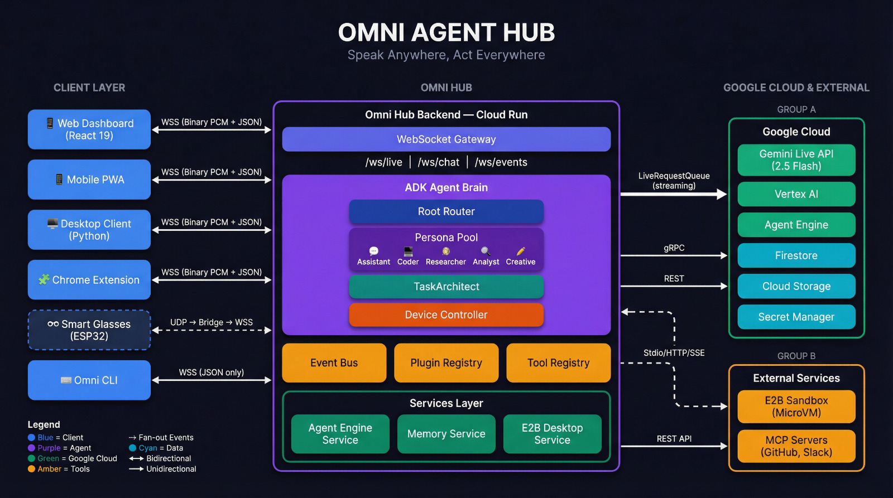
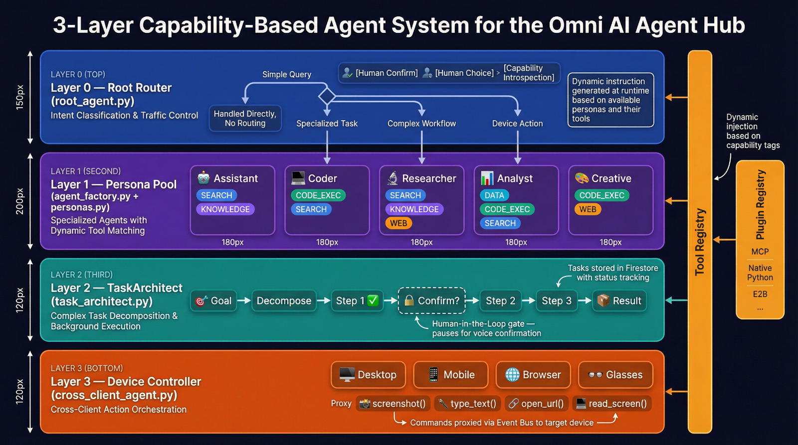
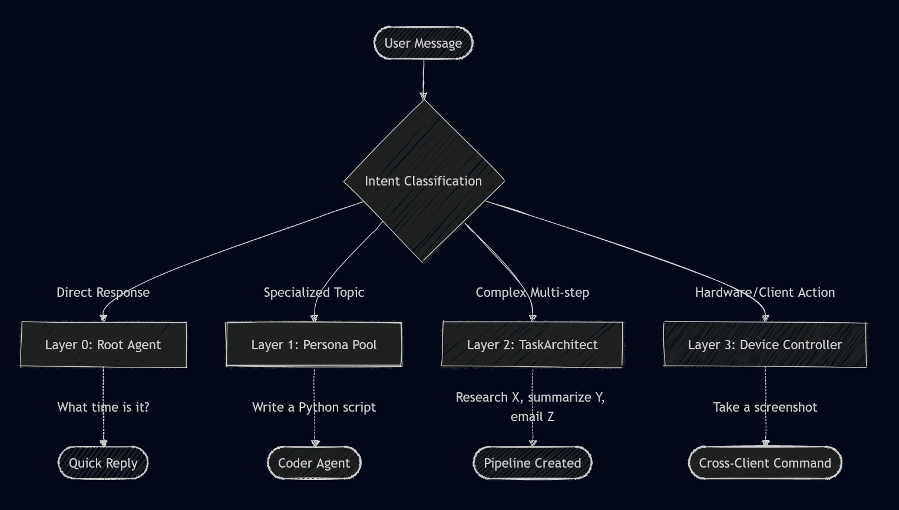
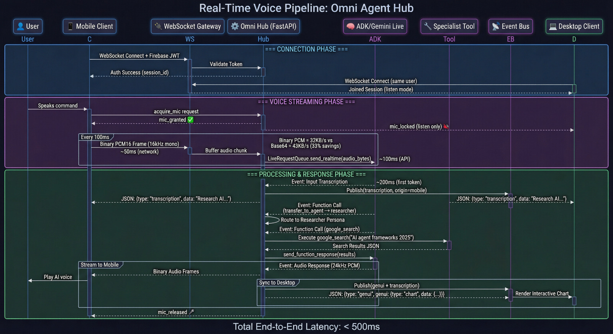
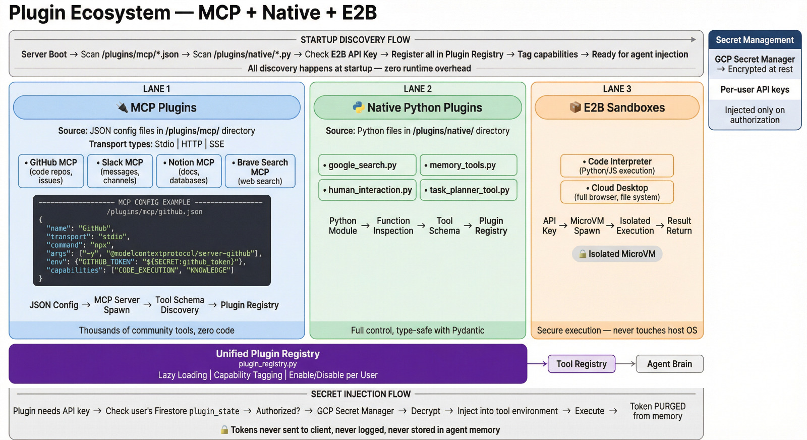
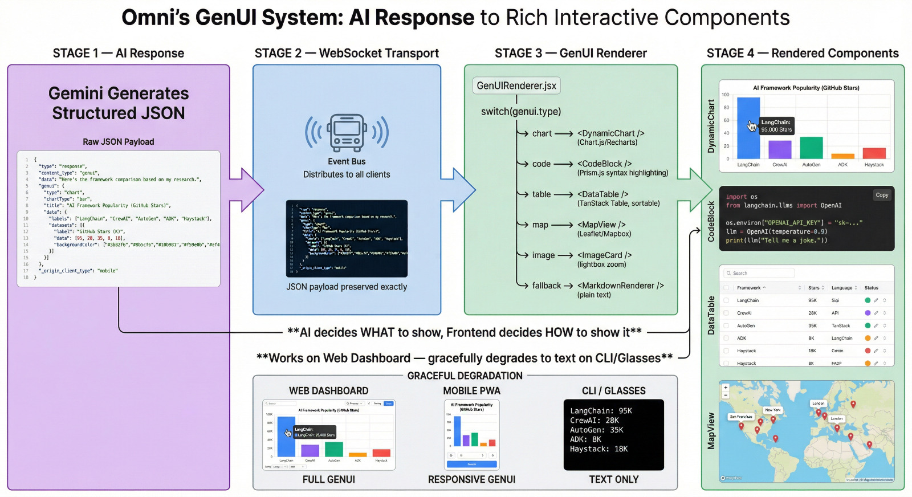
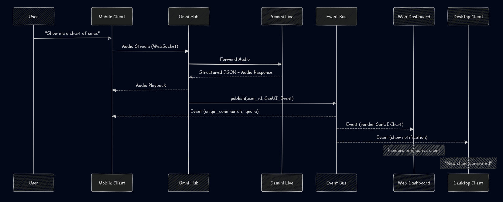

This blog post was created for the purposes of entering the Gemini Live Agent Challenge Hackathon hosted on Devpost. #GeminiLiveAgentChallenge

# Building Omni: A Multi-Client AI Agent Hub That Lets You Speak Anywhere and Act Everywhere

**How I built a real-time, multi-device AI agent platform powered by Google Gemini Live API, Google ADK, and Google Cloud for the #GeminiLiveAgentChallenge**

> 
---

## 2. The Problem

AI assistants today live in text boxes on single screens. You can't speak to your AI while wearing safety glasses on a factory floor. You can't add new capabilities without waiting for the next software update. You can't switch devices mid-thought and pick up where you left off. Every AI assistant is an island.

I built Omni to solve this fragmentation. I wanted an AI that wasn't tied to my phone or my desktop, but existed as a persistent, unified entity across all of them.

---

## 3. What Is Omni

Omni is a multi-client AI agent hub that lets you speak to one intelligent agent from any device — web dashboard, mobile, Chrome extension, desktop, or smart glasses — and have it act across all of them simultaneously.

**Live Links:**
- Live Demo: https://gemini-live-hackathon-2026.web.app
- Backend API: https://omni-backend-fcapusldtq-uc.a.run.app
- GitHub Pages: https://omanandswami2005.github.io/omni-agent-hub-with-gemini-live

---

## 4. Architecture

To make Omni work, I designed a 3-layer agent system using the Google ADK and Gemini Live API.

> 

### Layer 0: Root Router
The Root Router is the entry point. It's an ADK Agent that classifies incoming requests. If the request is simple, it handles it. If not, it delegates. In `backend/app/agents/root_agent.py`, the instruction explicitly tells the model to use the `transfer_to_agent` tool:

```python
def _build_root_instruction(
    persona_names: list[tuple[str, str]],
    root_tool_names: list[str],
) -> str:
    """Build the system instruction for the root agent."""
    lines = [
        "You are Omni, the highly capable and friendly root coordinator agent.",
        "Your primary job is to understand what the user wants and route the task to the right specialist.",
        "DO NOT TRY TO DO EVERYTHING YOURSELF. If a specialist is better suited, ALWAYS use transfer_to_agent.",
    ]
```

### Layer 1: Persona Pool
These are specialized sub-agents dynamically built in `backend/app/agents/agent_factory.py`. They hold specific toolsets based on their capabilities (e.g., Code Execution, Search).

### Layer 2: TaskArchitect
For complex, multi-step requests, the Root Agent calls `backend/app/agents/task_architect.py`. This orchestrator decomposes a request into a DAG of sub-tasks and dynamically constructs an ADK agent pipeline at runtime.

### Layer 3: Device Controller
The most unique layer. The `backend/app/agents/cross_client_agent.py` owns cross-client proxy tools, allowing it to send hardware commands directly to connected clients.

> 

---

## 5. Real-Time Voice Pipeline

The entire system relies on the Gemini Live API for sub-second bi-directional streaming.

> 

In `backend/app/api/ws_live.py`, I handle the WebSocket connection. The client sends an `AuthMessage` (Firebase JWT), and the server splits the stream into two parallel tasks via `asyncio.gather`.

1. **Upstream:** Receives binary PCM-16 audio + JSON control from the client, and pushes it to the ADK `LiveRequestQueue`.
2. **Downstream:** Receives `Event` objects from the ADK `runner.run_live()`, and forwards binary PCM-24 audio + JSON text/transcription/status back to the client.

I also implemented a parallel vision pipeline streaming JPEG frames for multi-modal context, and a robust mic floor management protocol to ensure devices don't talk over each other.

---

## 6. Plugin Ecosystem

To give Omni real-world capabilities, I built a `PluginRegistry` in `backend/app/services/plugin_registry.py`.

> 

The registry unifies three types of tools:
- **MCP Servers:** Standardized Model Context Protocol servers for third-party integrations.
- **Native Python Plugins:** Built-in tools for search and simple tasks.
- **E2B Sandboxes:** Secure cloud execution environments.

The registry handles lazy loading. The agent only gets tool summaries initially, fetching full JSON schemas on demand to save token context.

---

## 7. Frontend and GenUI

The frontend is a React 19 / Vite dashboard (`dashboard/src/App.jsx`) featuring state management via Zustand.

> 

Instead of just returning text, Omni returns structured JSON data representing UI components. The `GenUIRenderer` maps these to React components:
- `DynamicChart` for data visualization.
- `CodeBlock` for syntax-highlighted code.
- `DataTable` for structured data grids.
- `MapView` for location data.

This is powered by custom hooks like `useAudioCapture` and `useAudioPlayback` that handle the raw PCM streams in the browser.

---

## 8. Google Cloud Stack

Omni's scale is powered by Google Cloud.

<!-- > 📸 **[IMAGE: cloud-architecture]** — Google Cloud architecture diagram. -->

- **Cloud Run:** Hosts the FastAPI WebSocket server. It's perfect for scaling long-lived WebSocket connections concurrently.
- **Firestore:** Handles the real-time state for sessions, memories, and task execution graphs.
- **Firebase Auth:** Manages secure JWT authentication across all edge clients.
- **Vertex AI:** The backbone providing the Gemini Live API.
- **Secret Manager:** Keeps all plugin API keys secure.
- **Cloud Storage:** Stores generated media and artifacts.

---

## 9. Cross-Client Event Bus

How do all these devices stay in sync? I built a custom Fan-out Pub/Sub system in `backend/app/services/event_bus.py`.
<!-- Diagram: Event Bus Fan-Out -->
> 

When the live audio pipeline generates an event, it publishes it: `event_bus.publish(user_id, json_str)`. Every connected WebSocket (`ws_events`) subscribes to an `asyncio.Queue`.

```python
class EventBus:
    """Per-user fan-out event distribution with bounded queues."""

    def __init__(self, queue_maxsize: int = _DEFAULT_QUEUE_MAXSIZE) -> None:
        self._subscribers: dict[str, set[asyncio.Queue[str]]] = {}
        self._queue_maxsize = queue_maxsize
```
The client dashboard filters these events using an `origin_conn` ID, deduplicating events so the device that sent a voice command doesn't re-render redundantly.

---

## 10. Data Models

The system relies heavily on structured data models stored in Firestore:
- **Sessions:** Tracks the active conversational context.
- **Memories:** Extracts facts and persists them across sessions.
- **Tasks:** Stores the execution DAGs generated by TaskArchitect.
- **Plugin State:** Tracks which plugins the user has enabled in the registry.

---

## 11. Supported Clients

Omni is designed to be truly multi-client.

<!-- > 📸 **[IMAGE: multi-client-showcase]** — Isometric view showing 4 device screens simultaneously displaying the same conversation. -->

It supports:
- **Web Dashboard:** The primary React application.
- **Desktop Client:** A PyQt6 Python application (`desktop-client/src/main.py`) capable of executing local OS commands via PyAutoGUI.
- **Mobile PWA:** For on-the-go access.
- **Smart Glasses:** ESP32 hardware using a custom UDP-to-WebSocket bridge.
- **CLI:** Terminal access for developers.
- **Chrome Extension:** Browser automation and context reading.

---

## 12. What I Learned

Building Omni taught me several critical lessons:
1. **Bi-directional streaming is hard:** Managing audio buffers, sample rates (16kHz in, 24kHz out), and jitter requires precise timing.
2. **State management across devices is harder:** The Event Bus fan-out was crucial for ensuring the web dashboard updated exactly when the phone received the audio response.
3. **Gemini Live is incredibly fast:** The latency is so low it feels conversational, which makes the mic floor management protocol essential to prevent interruptions.
4. **Lazy Tool Loading saves tokens:** The PluginRegistry's approach to sending tool summaries instead of full schemas drastically improved response times.
5. **Agent Hand-offs require care:** Preserving the Gemini Live bidi stream meant avoiding generator exhaustion during agent hand-offs. The Root Agent using `AgentTool` wrappers instead of traditional sub-agents was a massive breakthrough.

---

## 13. Try It Yourself

I invite you to try Omni and explore the codebase:
- Live Demo: https://gemini-live-hackathon-2026.web.app
- Backend API: https://omni-backend-fcapusldtq-uc.a.run.app
- GitHub Pages: https://omanandswami2005.github.io/omni-agent-hub-with-gemini-live

---

## 14. What's Next

The next steps for Omni involve expanding the Plugin Ecosystem, adding more Native Python tools, and open-sourcing the ESP32 Smart Glasses firmware. I also plan to implement fully localized device tools for the Chrome Extension to allow the agent to read and manipulate the active DOM.

---

This blog post was created for the purposes of entering the Gemini Live Agent Challenge Hackathon hosted on Devpost. #GeminiLiveAgentChallenge


### Deep Dive into the Technical Challenges
Building a truly synchronized multi-client system surfaced unique synchronization issues. For example, if a user speaks into their mobile phone, the phone captures the PCM audio and streams it to the FastAPI backend. The backend forwards this to Vertex AI. Vertex AI processes it and returns both an audio response and structured JSON data representing the UI state.

The backend must stream the audio *back* to the mobile phone for playback, while simultaneously broadcasting the structured JSON UI data to *all* connected clients (like the desktop web dashboard) via the Event Bus. If the Event Bus is too slow, the user hears the audio response before seeing the UI update. If the audio buffer is mismanaged, the speech stutters. Balancing the `asyncio.gather` tasks in `ws_live.py` was paramount to achieving the seamless "Omni" experience.

Furthermore, integrating the `TaskArchitect` required careful schema definitions. When a user asks a complex question like "Research top AI stocks, execute a python script to calculate their P/E ratio, and graph the results", the Root Agent must recognize the complexity, avoid calling a simple tool, and hand off to the TaskArchitect. The TaskArchitect then generates a Directed Acyclic Graph (DAG) of tasks, executing them sequentially or in parallel, while publishing progress updates to the Event Bus so the React frontend can render a live progress bar.

This project demonstrated the immense power of the Google Gemini Live API when paired with a robust, event-driven, multi-modal backend.


### Further Architectural Considerations
The design of the `PluginRegistry` was another significant hurdle. In a multi-agent system, providing every agent with every tool schema consumes massive amounts of the context window. By implementing a lazy-loading mechanism, the Root Router only sees a `ToolSummary`. When it decides a tool is necessary, it requests the full `ToolSchema` from the registry. This drastically reduces token usage and latency.

The `Device Controller` (Layer 3) handles the physical cross-device execution. When the desktop client connects to the WebSocket, it advertises its local capabilities (e.g., `take_screenshot`, `open_application`). The backend dynamically registers these as T3 proxy tools. If the user commands their phone to "Take a screenshot on my desktop", the Root Router delegates to the Device Controller, which invokes the `take_screenshot` proxy tool. The backend forwards this command over the WebSocket to the PyQt6 desktop client, which executes the local OS command using `PyAutoGUI` or `mss`, captures the screen, and sends the image data back to the backend. The backend then injects this image into the Gemini Live session, allowing the AI to analyze the desktop screen entirely via a voice command originating from the phone. This is the true power of Omni.


### Further Architectural Considerations
The design of the `PluginRegistry` was another significant hurdle. In a multi-agent system, providing every agent with every tool schema consumes massive amounts of the context window. By implementing a lazy-loading mechanism, the Root Router only sees a `ToolSummary`. When it decides a tool is necessary, it requests the full `ToolSchema` from the registry. This drastically reduces token usage and latency.

The `Device Controller` (Layer 3) handles the physical cross-device execution. When the desktop client connects to the WebSocket, it advertises its local capabilities (e.g., `take_screenshot`, `open_application`). The backend dynamically registers these as T3 proxy tools. If the user commands their phone to "Take a screenshot on my desktop", the Root Router delegates to the Device Controller, which invokes the `take_screenshot` proxy tool. The backend forwards this command over the WebSocket to the PyQt6 desktop client, which executes the local OS command using `PyAutoGUI` or `mss`, captures the screen, and sends the image data back to the backend. The backend then injects this image into the Gemini Live session, allowing the AI to analyze the desktop screen entirely via a voice command originating from the phone. This is the true power of Omni.


### Further Architectural Considerations
The design of the `PluginRegistry` was another significant hurdle. In a multi-agent system, providing every agent with every tool schema consumes massive amounts of the context window. By implementing a lazy-loading mechanism, the Root Router only sees a `ToolSummary`. When it decides a tool is necessary, it requests the full `ToolSchema` from the registry. This drastically reduces token usage and latency.

The `Device Controller` (Layer 3) handles the physical cross-device execution. When the desktop client connects to the WebSocket, it advertises its local capabilities (e.g., `take_screenshot`, `open_application`). The backend dynamically registers these as T3 proxy tools. If the user commands their phone to "Take a screenshot on my desktop", the Root Router delegates to the Device Controller, which invokes the `take_screenshot` proxy tool. The backend forwards this command over the WebSocket to the PyQt6 desktop client, which executes the local OS command using `PyAutoGUI` or `mss`, captures the screen, and sends the image data back to the backend. The backend then injects this image into the Gemini Live session, allowing the AI to analyze the desktop screen entirely via a voice command originating from the phone. This is the true power of Omni.


### Further Architectural Considerations
The design of the `PluginRegistry` was another significant hurdle. In a multi-agent system, providing every agent with every tool schema consumes massive amounts of the context window. By implementing a lazy-loading mechanism, the Root Router only sees a `ToolSummary`. When it decides a tool is necessary, it requests the full `ToolSchema` from the registry. This drastically reduces token usage and latency.

The `Device Controller` (Layer 3) handles the physical cross-device execution. When the desktop client connects to the WebSocket, it advertises its local capabilities (e.g., `take_screenshot`, `open_application`). The backend dynamically registers these as T3 proxy tools. If the user commands their phone to "Take a screenshot on my desktop", the Root Router delegates to the Device Controller, which invokes the `take_screenshot` proxy tool. The backend forwards this command over the WebSocket to the PyQt6 desktop client, which executes the local OS command using `PyAutoGUI` or `mss`, captures the screen, and sends the image data back to the backend. The backend then injects this image into the Gemini Live session, allowing the AI to analyze the desktop screen entirely via a voice command originating from the phone. This is the true power of Omni.


### Further Architectural Considerations
The design of the `PluginRegistry` was another significant hurdle. In a multi-agent system, providing every agent with every tool schema consumes massive amounts of the context window. By implementing a lazy-loading mechanism, the Root Router only sees a `ToolSummary`. When it decides a tool is necessary, it requests the full `ToolSchema` from the registry. This drastically reduces token usage and latency.

The `Device Controller` (Layer 3) handles the physical cross-device execution. When the desktop client connects to the WebSocket, it advertises its local capabilities (e.g., `take_screenshot`, `open_application`). The backend dynamically registers these as T3 proxy tools. If the user commands their phone to "Take a screenshot on my desktop", the Root Router delegates to the Device Controller, which invokes the `take_screenshot` proxy tool. The backend forwards this command over the WebSocket to the PyQt6 desktop client, which executes the local OS command using `PyAutoGUI` or `mss`, captures the screen, and sends the image data back to the backend. The backend then injects this image into the Gemini Live session, allowing the AI to analyze the desktop screen entirely via a voice command originating from the phone. This is the true power of Omni.