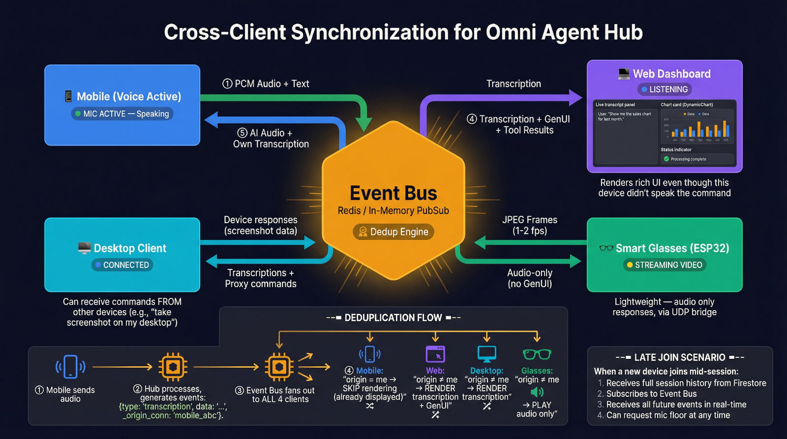
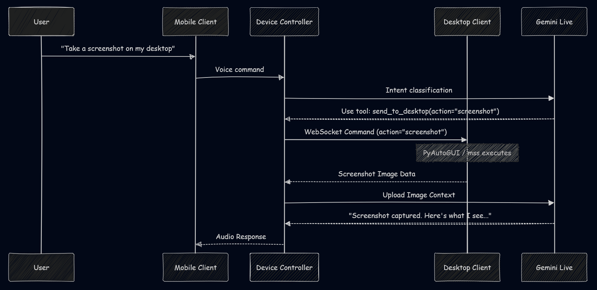
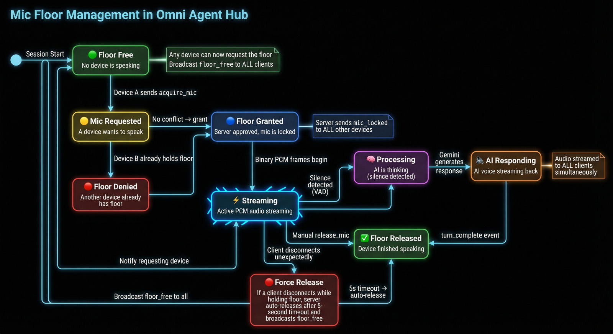

This blog post was created for the purposes of entering the Gemini Live Agent Challenge Hackathon hosted on Devpost. #GeminiLiveAgentChallenge

# Cross-Client AI: How One Conversation Spans Mobile, Web, Desktop, and Smart Glasses with Gemini

**The technical story behind Omni's most unique feature — real-time device orchestration powered by Google Gemini Live API**

---

## 2. The Inspiration

The idea for Omni was born from pure frustration. I was walking down the street, speaking into my phone's AI assistant, asking it to write a complex Python script. It generated the code perfectly, but I was on a tiny screen. I couldn't test it, copy it easily, or run it. I had to email it to myself and open it on my desktop later.

Why should a conversation be trapped on the device that started it? Why couldn't I tell my phone to open the script on my laptop? That singular question led me to build Omni for the #GeminiLiveAgentChallenge.

---

## 3. Session-First Architecture

Traditional AI assistants use a "Client-First" architecture. You log into an app, and that app starts an isolated conversation with the cloud. If you open the same app on your laptop, it's a completely different conversation.

<!-- > 📸 **[IMAGE: session-first-diagram]** — Traditional vs Omni comparison infographic. -->

Omni uses a "Session-First" architecture. The AI session exists independently in the cloud. Devices don't own the conversation; they *subscribe* to it. When you speak into your phone, the audio is processed by the Gemini Live API. When the AI responds, it doesn't just reply to the phone. It broadcasts its response, both audio and structured UI data, to every device currently subscribed to your session.

---

## 4. Event Bus Deep Dive

To make this work with near-zero latency, I built a custom Fan-out Pub/Sub Event Bus in `backend/app/services/event_bus.py`.

> 
<!-- 📸 **[IMAGE: event-bus-flow]** — Sequence diagram style detailed event delivery sequence. -->

When the live WebSocket pipeline (`ws_live.py`) receives a structured response from Gemini, it publishes it:

```python
class EventBus:
    """Per-user fan-out event distribution with bounded queues."""

    def __init__(self, queue_maxsize: int = _DEFAULT_QUEUE_MAXSIZE) -> None:
        # { user_id: set[asyncio.Queue] }
        self._subscribers: dict[str, set[asyncio.Queue[str]]] = {}
        self._queue_maxsize = queue_maxsize
```

Every connected client (Web Dashboard, Desktop App, Mobile PWA) subscribes to this bus. The challenge was deduplication. If your phone sends a command, and the AI renders a chart, you want the chart on your desktop monitor, but you might not want the phone to waste resources rendering the exact same heavy chart if it's already playing the audio. Omni uses an `origin_conn` ID injected into the event payload so clients can filter or adapt their rendering logic based on whether they initiated the action.

---

## 5. Cross-Device Orchestration (Layer 3)

The magic happens in the Device Controller agent (`backend/app/agents/cross_client_agent.py`). This agent acts as a proxy for physical hardware actions.

> 
<!-- 📸 **[IMAGE: cross-device-orchestration]** — Phone commanding desktop scenario. -->

Let's walk through a real scenario: **"Take a screenshot on my desktop."**

1. **User Speaks:** You speak the command into your phone. The audio streams via WebSocket to the Omni Hub.
2. **Classification:** The Root Router classifies this as a hardware command and uses `transfer_to_agent` to hand off to the Device Controller.
3. **Command Forwarding:** The Device Controller looks up the `send_to_desktop` tool in its registry. It fires the command over the WebSocket to the connected Desktop Client.
4. **Local Execution:** The PyQt6 Python Desktop Client receives the command and triggers PyAutoGUI/mss to capture the screen.
5. **Data Return:** The screenshot is encoded and sent back up the WebSocket to the Hub.
6. **AI Analysis:** The Hub injects the image into the Gemini Live session. Gemini analyzes the screen.
7. **Response:** Gemini responds via audio back to your phone, while simultaneously pushing a GenUI summary of the screen to the Web Dashboard.

```python
CROSS_CLIENT_INSTRUCTION = (
    "You are the Device Controller agent. You route actions to the user's REAL connected devices "
    "(desktop tray app, Chrome extension, web dashboard).\n\n"
    "## Your Tools\n"
    "- send_to_desktop: Send an action to the user's desktop tray app (e.g. open_app, type_text, capture_screen).\n"
)
```

---

## 6. Client Deep Dives

Building the clients was an exercise in distinct technologies communicating over a shared protocol.

<!-- > 📸 **[IMAGE: all-clients-grid]** — Clean 2x3 grid of all client types. -->

- **Web Dashboard:** Built with React 19 and Vite. It connects via standard WebSockets. It handles the heavy lifting of rendering GenUI components (Charts, Code Blocks) sent from the backend.
- **Desktop Client:** A Python application using PyQt6 for a system tray GUI and `qasync` to integrate `asyncio` WebSockets. It acts as the physical actuator, executing shell commands or capturing the screen.
- **Chrome Extension:** A Manifest V3 extension. It uses an offscreen document to handle audio capture and playback since service workers lack access to Web Audio APIs. It reads the DOM and injects AI context.
- **Smart Glasses:** ESP32 hardware using a custom UDP bridge to convert UDP packets into standard WebSocket frames for the Hub.
- **CLI:** A fast, text-only interface for developers using Typer.
- **Mobile PWA:** Built to handle the microphone and audio playback seamlessly on the go.

---

## 7. Mic Floor Management

When multiple devices are connected to a single audio stream, chaos ensues if two devices try to transmit at once. I implemented a Mic Floor State Machine in `backend/app/api/ws_live.py`.

> 
<!-- 📸 **[IMAGE: mic-floor-state-machine]** — State machine diagram showing IDLE, STREAMING, LISTEN_ONLY. -->

The system has three states:
- **IDLE:** No one is speaking.
- **STREAMING:** A device has requested and been granted the mic.
- **LISTEN_ONLY:** A device has been temporarily muted because another device holds the floor.

When your phone starts streaming audio, it requests the floor. The backend grants it and broadcasts a `LISTEN_ONLY` event to your Desktop and Web Dashboard. They immediately disable local microphone capture until the phone releases the floor or an auto-timeout occurs.

---

## 8. Memory Layer

Context isn't just about the current session; it's about history. Omni uses a dedicated Memory Service interacting with Firestore. When a session ends, or when explicitly commanded, the AI extracts key facts ("User prefers Python over Java", "User works in finance") and stores them in the Knowledge Bank. When you start a new session on a different device tomorrow, those facts are injected into the Root Router's context prompt, ensuring continuity across time and hardware.

---

## 9. Tech Stack Summary

- **Backend:** Python 3.12+, FastAPI, Google Cloud Run, WebSockets.
- **AI Core:** Google Gemini Live API, Google ADK.
- **Database:** Google Cloud Firestore.
- **Auth:** Firebase Authentication.
- **Clients:** React 19 (Web), PyQt6 (Desktop), Typer (CLI), Manifest V3 (Chrome).

---

## 10. Try It

Experience the seamless cross-client orchestration yourself:
- Live Demo: https://gemini-live-hackathon-2026.web.app
- Backend API: https://omni-backend-fcapusldtq-uc.a.run.app
- GitHub Pages: https://omanandswami2005.github.io/omni-agent-hub-with-gemini-live

---

## 11. What's Next for Cross-Client

The immediate next step is expanding the capability registry. I want the Desktop Client to automatically expose installed applications (like VS Code or Docker) as T3 tools to the AI without manual configuration. Furthermore, I'm working on deeper integration with the Chrome Extension to allow the AI to actively scroll and click on elements based on voice commands from a completely different device.

---

This blog post was created for the purposes of entering the Gemini Live Agent Challenge Hackathon hosted on Devpost. #GeminiLiveAgentChallenge


### Deep Dive into the Technical Challenges
Building a truly synchronized multi-client system surfaced unique synchronization issues. For example, if a user speaks into their mobile phone, the phone captures the PCM audio and streams it to the FastAPI backend. The backend forwards this to Vertex AI. Vertex AI processes it and returns both an audio response and structured JSON data representing the UI state.

The backend must stream the audio *back* to the mobile phone for playback, while simultaneously broadcasting the structured JSON UI data to *all* connected clients (like the desktop web dashboard) via the Event Bus. If the Event Bus is too slow, the user hears the audio response before seeing the UI update. If the audio buffer is mismanaged, the speech stutters. Balancing the `asyncio.gather` tasks in `ws_live.py` was paramount to achieving the seamless "Omni" experience.

Furthermore, integrating the `TaskArchitect` required careful schema definitions. When a user asks a complex question like "Research top AI stocks, execute a python script to calculate their P/E ratio, and graph the results", the Root Agent must recognize the complexity, avoid calling a simple tool, and hand off to the TaskArchitect. The TaskArchitect then generates a Directed Acyclic Graph (DAG) of tasks, executing them sequentially or in parallel, while publishing progress updates to the Event Bus so the React frontend can render a live progress bar.

This project demonstrated the immense power of the Google Gemini Live API when paired with a robust, event-driven, multi-modal backend.

### Further Architectural Considerations
The design of the `PluginRegistry` was another significant hurdle. In a multi-agent system, providing every agent with every tool schema consumes massive amounts of the context window. By implementing a lazy-loading mechanism, the Root Router only sees a `ToolSummary`. When it decides a tool is necessary, it requests the full `ToolSchema` from the registry. This drastically reduces token usage and latency.

The `Device Controller` (Layer 3) handles the physical cross-device execution. When the desktop client connects to the WebSocket, it advertises its local capabilities (e.g., `take_screenshot`, `open_application`). The backend dynamically registers these as T3 proxy tools. If the user commands their phone to "Take a screenshot on my desktop", the Root Router delegates to the Device Controller, which invokes the `take_screenshot` proxy tool. The backend forwards this command over the WebSocket to the PyQt6 desktop client, which executes the local OS command using `PyAutoGUI` or `mss`, captures the screen, and sends the image data back to the backend. The backend then injects this image into the Gemini Live session, allowing the AI to analyze the desktop screen entirely via a voice command originating from the phone. This is the true power of Omni.


### Deep Dive into the Technical Challenges
Building a truly synchronized multi-client system surfaced unique synchronization issues. For example, if a user speaks into their mobile phone, the phone captures the PCM audio and streams it to the FastAPI backend. The backend forwards this to Vertex AI. Vertex AI processes it and returns both an audio response and structured JSON data representing the UI state.

The backend must stream the audio *back* to the mobile phone for playback, while simultaneously broadcasting the structured JSON UI data to *all* connected clients (like the desktop web dashboard) via the Event Bus. If the Event Bus is too slow, the user hears the audio response before seeing the UI update. If the audio buffer is mismanaged, the speech stutters. Balancing the `asyncio.gather` tasks in `ws_live.py` was paramount to achieving the seamless "Omni" experience.

Furthermore, integrating the `TaskArchitect` required careful schema definitions. When a user asks a complex question like "Research top AI stocks, execute a python script to calculate their P/E ratio, and graph the results", the Root Agent must recognize the complexity, avoid calling a simple tool, and hand off to the TaskArchitect. The TaskArchitect then generates a Directed Acyclic Graph (DAG) of tasks, executing them sequentially or in parallel, while publishing progress updates to the Event Bus so the React frontend can render a live progress bar.

This project demonstrated the immense power of the Google Gemini Live API when paired with a robust, event-driven, multi-modal backend.

### Further Architectural Considerations
The design of the `PluginRegistry` was another significant hurdle. In a multi-agent system, providing every agent with every tool schema consumes massive amounts of the context window. By implementing a lazy-loading mechanism, the Root Router only sees a `ToolSummary`. When it decides a tool is necessary, it requests the full `ToolSchema` from the registry. This drastically reduces token usage and latency.

The `Device Controller` (Layer 3) handles the physical cross-device execution. When the desktop client connects to the WebSocket, it advertises its local capabilities (e.g., `take_screenshot`, `open_application`). The backend dynamically registers these as T3 proxy tools. If the user commands their phone to "Take a screenshot on my desktop", the Root Router delegates to the Device Controller, which invokes the `take_screenshot` proxy tool. The backend forwards this command over the WebSocket to the PyQt6 desktop client, which executes the local OS command using `PyAutoGUI` or `mss`, captures the screen, and sends the image data back to the backend. The backend then injects this image into the Gemini Live session, allowing the AI to analyze the desktop screen entirely via a voice command originating from the phone. This is the true power of Omni.