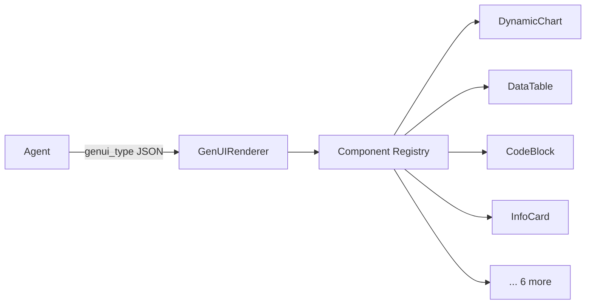

# Dashboard Architecture

## Stack

| Layer | Technology |
|---|---|
| Framework | React 19 |
| Build Tool | Vite 6 |
| Styling | Tailwind CSS 4 |
| State | Zustand 5 (8 stores) |
| UI Components | shadcn/ui |
| Auth | Firebase Auth (Google sign-in) |

## Directory Structure

```
dashboard/src/
├── App.jsx                 # Root app with router
├── main.jsx                # Entry point
├── components/
│   ├── layout/             # Sidebar, header, main layout
│   ├── chat/               # Chat messages, input, audio
│   ├── genui/              # GenUI renderer + components
│   ├── persona/            # Persona selector
│   ├── mcp/                # Plugin store UI
│   ├── clients/            # Connected device viewer
│   ├── session/            # Session history
│   ├── sandbox/            # E2B desktop viewer
│   ├── auth/               # Login/signup
│   ├── shared/             # Shared components
│   └── ui/                 # shadcn/ui primitives
├── hooks/                  # Custom React hooks
├── lib/                    # Utilities
├── pages/                  # Route pages
├── stores/                 # Zustand stores
└── styles/                 # Global CSS
```

## State Management

Eight Zustand stores manage all client-side state:

| Store | Purpose |
|---|---|
| `authStore` | Firebase auth state, token refresh |
| `chatStore` | Messages, streaming state |
| `personaStore` | Active persona, available personas |
| `mcpStore` | Plugin catalog, enabled plugins |
| `clientStore` | Connected devices |
| `sessionStore` | Session history |
| `themeStore` | Dark/light mode |
| `uiStore` | Sidebar, modals, toasts |

## GenUI System

Agents can return structured JSON that the dashboard renders as interactive React components:


