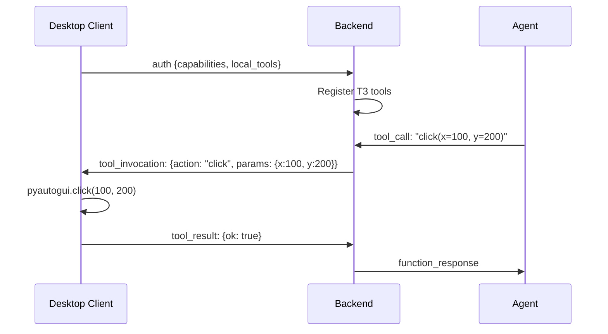

# Desktop Client Architecture

## Stack

| Layer | Technology |
|---|---|
| GUI | PyQt6 + qasync |
| Audio | sounddevice + numpy |
| Screen Capture | mss + Pillow |
| Input Automation | pyautogui |
| Auth | Firebase REST API (httpx) |
| Transport | WebSocket (websockets) |

## Plugin System

The desktop client uses a plugin-based architecture where each capability is a separate module:

```
desktop-client/src/
├── main.py               # Typer CLI entry point
├── ws_client.py          # WebSocket client with auto-reconnect
├── gui.py                # PyQt6 main window
├── config.py             # Pydantic settings
├── plugin_registry.py    # Plugin discovery + registration
├── plugins/
│   ├── file_plugin.py    # File read/write/list/info + search
│   ├── command_plugin.py # Shell command execution
│   ├── screen_plugin.py  # Screen capture
│   └── input_plugin.py   # Mouse/keyboard automation
├── files.py              # Sandboxed file access
├── screen.py             # Screen capture implementation
├── actions.py            # pyautogui wrappers
├── audio.py              # PCM16 audio streaming
├── login_dialog.py       # Firebase login UI
└── firebase_auth.py      # Firebase REST auth
```

## T3 Tool Registration

When the desktop client connects, it advertises its capabilities and tool definitions to the backend. The backend registers these as **T3 client tools** that the agent can invoke via reverse-RPC:



## File Upload to E2B

The desktop client can upload local files to an E2B cloud desktop sandbox, enabling workflows like:

1. User has a CSV on their local machine
2. Agent instructs desktop client to upload it to E2B
3. Agent runs analysis code in the E2B sandbox
4. Results displayed via GenUI on the dashboard
