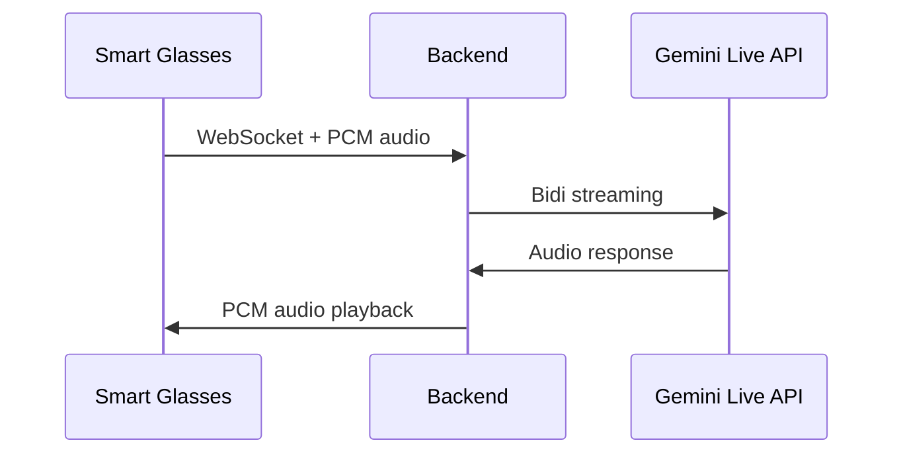

# Smart Glasses Architecture

The Omni Smart Glasses client runs on ESP32-based wearable devices, providing hands-free voice interaction.

!!! note "Hardware prototype"
    This component is a hardware prototype. See the `smart-glasses/` directory for schematics and firmware.

## Overview

The smart glasses provide:

- **Voice input** — Onboard microphone captures speech
- **Audio output** — Bone conduction speaker for private audio
- **WiFi connectivity** — Connects to the Omni backend over WebSocket
- **Minimal display** — Optional small OLED/LED for status indication

## Communication Flow

