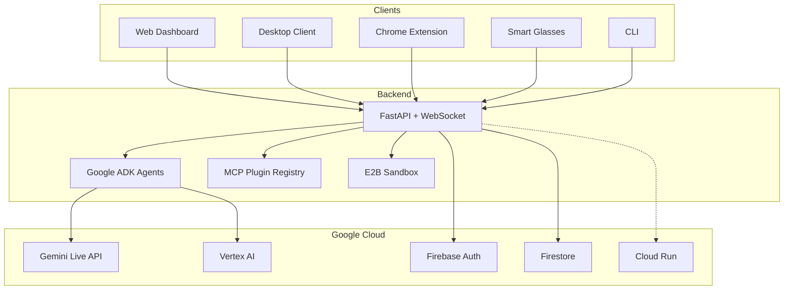

---
hide:
  - navigation
  - toc
---

# OMNI
### Speak anywhere. Act everywhere.

One AI brain. Every device. Infinite capabilities.

[Get Started :material-rocket-launch:](getting-started/index.md){ .md-button .md-button--primary }
[View on GitHub :material-github:](https://github.com/omanandswami2005/omni-agent-hub-with-gemini-live/tree/main/site-docs){ .md-button }

---

## What is Omni?

**Omni** is a multi-client AI agent hub that lets you speak to one intelligent agent from any device — web dashboard, mobile, Chrome extension, desktop, or smart glasses — and have it act across all of them simultaneously.

Built for the [Gemini Live Agent Challenge](https://googleai.devpost.com/) hackathon, Omni demonstrates how a single AI brain powered by **Google Gemini Live API** and **Google ADK** can orchestrate actions across every device you own.

### :material-microphone: One Voice, Every Device
Web, mobile, Chrome extension, desktop tray app, ESP32 glasses — speak from anywhere.

### :material-puzzle: MCP Plugin Store
Install new agent capabilities in one click, like an app store for AI skills.

### :material-chart-bar: GenUI
Agent renders live charts, tables, code blocks, and cards on your dashboard while speaking.

### :material-account-switch: Agent Personas
Switch between specialized AI personalities — analyst, coder, researcher — with distinct voices and skills.

### :material-monitor: Cloud Desktop
Full Linux desktop in the cloud — agents can launch apps, write code, run scripts.

### :material-swap-horizontal: Cross-Client Actions
Say "save this to my dashboard" from your phone — it appears on your desktop instantly.

## Architecture at a Glance

## Quick Links

| Topic | Description |
|---|---|
| [Installation](getting-started/installation.md) | Set up the backend, dashboard, and desktop client |
| [Architecture](architecture/index.md) | Understand the system design |
| [Plugin Development](guides/plugin-development.md) | Build custom MCP plugins |
| [API Reference](api/rest.md) | REST & WebSocket API docs |
| [Deployment](deployment/gcp-setup.md) | Deploy to GCP with Terraform |
| [Contributing](contributing/documentation-guide.md) | How to write and contribute docs |
